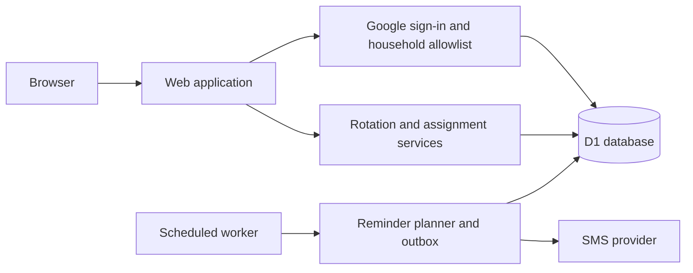

# ChoRotate

<p align="center">
  <a href="https://github.com/shanebishop1/chorotate/actions/workflows/ci.yml"></a>
</p>

ChoRotate is a private household chore scheduler. It keeps recurring responsibilities clear, shows who is responsible now and next, and gives the household a shared history of every change.

## What it does

- Builds a recurring schedule for each chore, including chores that turn over on different days.
- Shows current and upcoming assignments for the household and each member.
- Lets authorized members reassign a turn or swap two assignments.
- Prevents changes to completed periods and detects conflicting edits.
- Records an audit history of automatic and manual assignment changes.
- Sends optional, consent-based SMS reminders without exposing contact details in the UI.

## Architecture

ChoRotate runs as one application with a single database. The web app, authenticated actions, and scheduled reminder worker share the same domain rules rather than duplicating schedule logic.



The database is the source of truth for household membership, schedules, assignment history, sessions, and reminder state. Assignment changes use version checks and database constraints so concurrent edits cannot silently overwrite each other. Reminder delivery uses a durable outbox so scheduled runs can recover safely from overlap and provider failures.

## Run locally

Install [Mise](https://mise.jdx.dev/), then clone and prepare the project:

```sh
git clone https://github.com/shanebishop1/chorotate.git
cd chorotate
mise install
npm ci
cp .dev.vars.example .dev.vars
```

Create the local database and start the app:

```sh
npx wrangler d1 migrations apply chorotate-local --local
npm run seed:local
npm run dev
```

Open <http://localhost:5173>. The included seed contains placeholder household data and cannot access production resources or send messages.

The default environment values intentionally cannot complete Google sign-in. To test authentication, use a separate Google OAuth client and add the matching test email to your local household allowlist.

Run the standard project checks with:

```sh
npm run check
```

Browser tests require Chromium:

```sh
npm run test:browser:install
npm run test:browser
```

## Operations

Production setup, deployment, contact handling, SMS delivery constraints, and rollback procedures are documented in the [operator runbook](docs/operations/operator-runbook.md). Security boundaries are documented separately in the [security contract](docs/operations/security.md).
