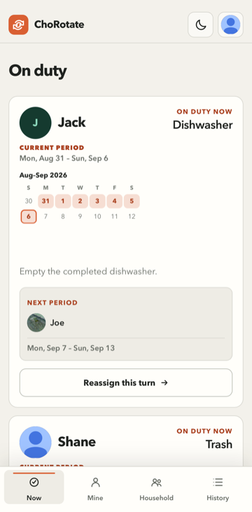
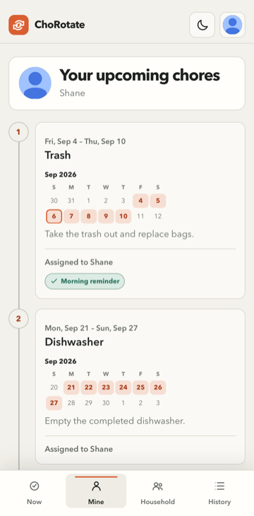
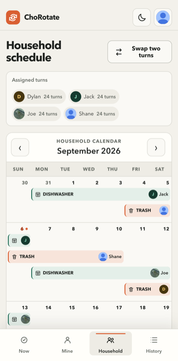
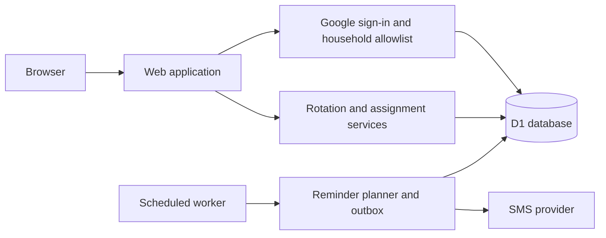

# ChoRotate

<a href="https://github.com/shanebishop1/chorotate/actions/workflows/ci.yml"></a>

ChoRotate lets you and your roommates track chores on a shared calendar and get SMS reminders when it's your turn. The web app, Google authentication, and scheduled text-message jobs are designed to deploy easily to Cloudflare, and the modular open-source code is easy for you or your coding agents to customize for your household.

<table>
  <tr>
    <td align="center" valign="top">
      <br />
      See the household's current assignments and next rotation.
    </td>
    <td align="center" valign="top">
      <br />
      See your upcoming chores and scheduled reminders.
    </td>
    <td align="center" valign="top">
      <br />
      Review the full household schedule and swap turns.
    </td>
  </tr>
</table>

## What it does

- Builds a recurring schedule for each chore, including chores that turn over on different weekdays.
- Shows current and upcoming assignments for the household and each member.
- Provides a household calendar and history of changes.
- Lets authorized members reassign a turn or swap two assignments.
- Prevents changes to completed periods and detects conflicting edits.
- Records an audit history of automatic and manual assignment changes.
- Sends optional, consent-based SMS reminders without exposing contact details in the UI.

## Architecture

ChoRotate runs as one application with a single database. The web app, authenticated actions, and scheduled reminder worker share the same domain rules rather than duplicating schedule logic.



The database is the source of truth for household membership, schedules, assignment history, sessions, and reminder state. Assignment changes use version checks and database constraints so concurrent edits cannot silently overwrite each other. Reminder delivery uses a durable outbox so scheduled runs can recover safely from overlap and provider failures.

## Run locally

Install [Mise](https://mise.jdx.dev/), then clone and prepare the project:

```sh
git clone https://github.com/shanebishop1/chorotate.git
cd chorotate
mise install
npm ci
cp .dev.vars.example .dev.vars
```

Create your local household and start the app:

```sh
mkdir -p .chorotate
cp seed/operator-bootstrap.example.json .chorotate/operator-bootstrap.json
chmod 600 .chorotate/operator-bootstrap.json
# Edit .chorotate/operator-bootstrap.json with your roommates and chores.
npm run operator:bootstrap:local -- \
  --input .chorotate/operator-bootstrap.json \
  --time-zone America/New_York \
  --week-start monday \
  --evening-time 20:00 \
  --morning-time 08:00
npm run dev
```

Open <http://localhost:5173> and click **Sign in locally**. No Google credentials or Cloudflare account are needed. The first roommate in your configuration is used for local sign-in; SMS is disabled.

Local sign-in works only in the development build on loopback, with `LOCAL_AUTH_ENABLED=true`. Production builds cannot enable it, even if the flag is set. Do not expose the development server through a tunnel or reverse proxy.

### Household configuration

Edit `.chorotate/operator-bootstrap.json` to set roommate names, emails, chores, instructions, weekdays, and rotation order. The same JSON format configures a fresh production household. Bootstrap is first-run-only, not a way to overwrite an existing schedule. See the [custom household setup](docs/operations/operator-runbook.md#custom-local-household) for the field rules.

To run the app with neutral demo data instead, use `npm run seed:local` after applying migrations. This is optional and should not be used with the custom bootstrap in the same local database.

Run the standard project checks with:

```sh
npm run check
```

Browser tests require Chromium:

```sh
npm run test:browser:install
npm run test:browser
```

## Operations

The [operator runbook](docs/operations/operator-runbook.md) walks through Google Cloud Console, Cloudflare setup, where each setting and secret goes, household configuration, deployment, optional SMS, and rollback. The [security contract](docs/operations/security.md) describes authentication and local-development safeguards.

## License

[MIT](LICENSE)
