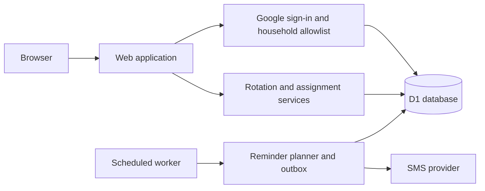

# ChoRotate

<a href="https://github.com/shanebishop1/chorotate/actions/workflows/ci.yml"></a>

ChoRotate lets you and your roommates track chores on a shared calendar and get SMS reminders when it's your turn. The web app, Google authentication, and scheduled text-message jobs are designed to deploy easily to Cloudflare, and the modular open-source code is easy for you or your coding agents to customize for your household.

<table>
  <tr>
    <td align="center" valign="top">
      <br />
      See the household's current assignments and next rotation.
    </td>
    <td align="center" valign="top">
      <br />
      See your upcoming chores and scheduled reminders.
    </td>
    <td align="center" valign="top">
      <br />
      Review the full household schedule and swap turns.
    </td>
  </tr>
</table>

## What it does

- Builds a recurring schedule for each chore, including chores that turn over on different weekdays.
- Shows current and upcoming assignments for the household and each member.
- Provides a household calendar and history of changes.
- Lets authorized members reassign a turn or swap two assignments.
- Prevents changes to completed periods and detects conflicting edits.
- Records an audit history of automatic and manual assignment changes.
- Sends optional, consent-based SMS reminders without exposing contact details in the UI.

## Architecture

ChoRotate runs as one application with a single database. The web app, authenticated actions, and scheduled reminder worker share the same domain rules rather than duplicating schedule logic.



The database is the source of truth for household membership, schedules, assignment history, sessions, and reminder state. Assignment changes use version checks and database constraints so concurrent edits cannot silently overwrite each other. Reminder delivery uses a durable outbox so scheduled runs can recover safely from overlap and provider failures.

## Run locally

No Google, Cloudflare, or SMS account is needed locally. To share the app online, skip to [Deploy your household](docs/operations/operator-runbook.md#deploy-your-household).

### 1. Install and prepare

Install Git and [Mise](https://mise.jdx.dev/getting-started.html), including shell activation. Use Bash/Zsh on macOS, Linux, or Windows WSL:

```sh
git clone https://github.com/shanebishop1/chorotate.git
cd chorotate
mise install
npm ci
cp .dev.vars.example .dev.vars
mkdir -p .chorotate
cp seed/operator-bootstrap.example.json .chorotate/operator-bootstrap.json
chmod 600 .chorotate/operator-bootstrap.json
```

### 2. Configure your household

Edit `.chorotate/operator-bootstrap.json` with your roommates and chores using the [field guide](docs/operations/operator-runbook.md#household-configuration). Include every member ID once in each rotation, and choose a start date on the chore's starting weekday. Keep the phone and consent defaults.

Add these lines to `.dev.vars`, choosing your household's [IANA time zone](https://en.wikipedia.org/wiki/List_of_tz_database_time_zones):

```text
HOUSEHOLD_TIME_ZONE=America/New_York
HOUSEHOLD_WEEK_START=monday
```

### 3. Bootstrap and sign in

Use the **same time zone and week start** in the command below. Bootstrap applies the local migrations automatically and is first-run-only; do not also run the demo seed.

```sh
npm run operator:bootstrap:local -- \
  --input .chorotate/operator-bootstrap.json \
  --time-zone America/New_York \
  --week-start monday \
  --evening-time 20:00 \
  --morning-time 08:00
npm run dev
```

Open **<http://localhost:5173>** and click **Sign in locally**, then **Prepare schedule** if the Now view is empty. You should see current and upcoming assignments. Local sign-in uses the first roommate in your JSON; SMS is disabled.

On later visits, run only `npm run dev`. See [existing local data](docs/operations/operator-runbook.md#custom-local-household) before changing households, or the [optional demo seed](docs/operations/operator-runbook.md#fast-local-development-no-oauth) for a no-edit preview in a fresh checkout.

Local sign-in is development-only and requires loopback with `LOCAL_AUTH_ENABLED=true`. Never expose the dev server through a tunnel or reverse proxy.

### Development checks

These checks are for code changes, not required setup steps:

```sh
npm run check
```

Browser tests require Chromium:

```sh
npm run test:browser:install
npm run test:browser
```

## Operations

See the [operator runbook](docs/operations/operator-runbook.md) for deployment, household configuration, SMS, and recovery, and the [security contract](docs/operations/security.md) for authentication safeguards.

## License

[MIT](LICENSE)
