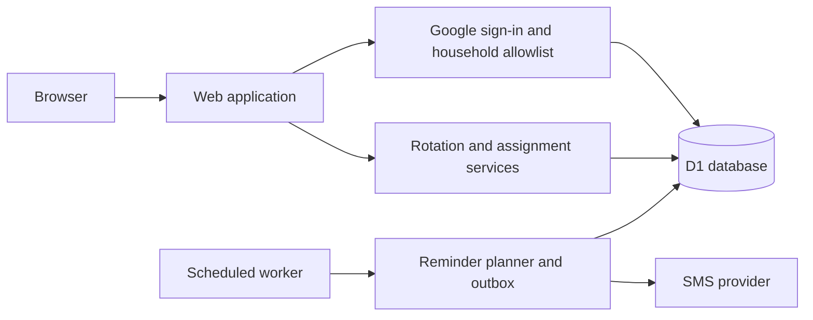

# ChoRotate

<p align="center">
  <a href="https://github.com/shanebishop1/chorotate/actions/workflows/ci.yml"></a>
</p>

ChoRotate lets you and your roommates track chores on a shared calendar and get SMS reminders when it's your turn. The web app, Google authentication, and scheduled text-message jobs are designed to deploy easily to Cloudflare, and the modular open-source code is easy for you or your coding agents to customize for your household.

## What it does

- Builds a recurring schedule for each chore, including chores that turn over on different weekdays.
- Shows current and upcoming assignments for the household and each member.
- Provides a household calendar and history of changes.
- Lets authorized members reassign a turn or swap two assignments.
- Prevents changes to completed periods and detects conflicting edits.
- Records an audit history of automatic and manual assignment changes.
- Sends optional, consent-based SMS reminders without exposing contact details in the UI.

## Architecture

ChoRotate runs as one application with a single database. The web app, authenticated actions, and scheduled reminder worker share the same domain rules rather than duplicating schedule logic.



The database is the source of truth for household membership, schedules, assignment history, sessions, and reminder state. Assignment changes use version checks and database constraints so concurrent edits cannot silently overwrite each other. Reminder delivery uses a durable outbox so scheduled runs can recover safely from overlap and provider failures.

## Run locally

Install [Mise](https://mise.jdx.dev/), then clone and prepare the project:

```sh
git clone https://github.com/shanebishop1/chorotate.git
cd chorotate
mise install
npm ci
cp .dev.vars.example .dev.vars
```

Create the local database and start the app:

```sh
npx wrangler d1 migrations apply chorotate-local --local
npm run seed:local
npm run dev
```

Open <http://localhost:5173> and click **Sign in locally**. No Google credentials or Cloudflare account are needed. You can use the calendar and change assignments with the included demo roommates and chores; SMS is disabled.

Local sign-in works only in the development build on loopback, with `LOCAL_AUTH_ENABLED=true`. Production builds cannot enable it, even if the flag is set. Do not expose the development server through a tunnel or reverse proxy.

### Your roommates and chores

For your own data, use the [custom local household setup](docs/operations/operator-runbook.md#custom-local-household) **instead of** `npm run seed:local`. Copy `seed/operator-bootstrap.example.json` into the ignored `.chorotate/` directory, edit the roommate names and chores, and run `npm run operator:bootstrap:local` with the options in that guide. This also works without Google sign-in and signs you in as the first roommate in your configuration.

The same JSON format configures a fresh production household. It supports chore names and instructions, the weekday each turn starts, and the rotation order. Bootstrap is first-run-only, not a way to overwrite an existing schedule.

Run the standard project checks with:

```sh
npm run check
```

Browser tests require Chromium:

```sh
npm run test:browser:install
npm run test:browser
```

## Operations

The [operator runbook](docs/operations/operator-runbook.md) walks through Google Cloud Console, Cloudflare setup, where each setting and secret goes, household configuration, deployment, optional SMS, and rollback. The [security contract](docs/operations/security.md) describes authentication and local-development safeguards.

## License

[MIT](LICENSE). Fork it, modify it, and share it. Keep the license notice with your copy.
