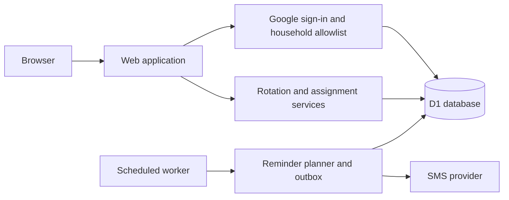

# ChoRotate

ChoRotate lets you and your roommates track chores on a shared calendar and get SMS reminders when it's your turn. The web app, Google authentication, and scheduled text-message jobs are designed to deploy easily to Cloudflare, and the modular open-source code is easy for you or your coding agents to customize for your household.

<table>
  <tr>
    <td align="center" valign="top">
       
      See the household's current assignments and next rotation.
    </td>
    <td align="center" valign="top">
       
      See your upcoming chores and scheduled reminders.
    </td>
    <td align="center" valign="top">
       
      Review the full household schedule and swap turns.
    </td>
  </tr>
</table>

## What it does

- Builds a recurring schedule for each chore, including chores that turn over on different weekdays.
- Shows current and upcoming assignments for the household and each member.
- Provides a household calendar and history of changes.
- Lets authorized members reassign a turn or swap two assignments.
- Prevents changes to completed periods and detects conflicting edits.
- Records an audit history of automatic and manual assignment changes.
- Sends optional, consent-based SMS reminders without exposing contact details in the UI.

## Architecture

ChoRotate runs as one application with a single database. The web app, authenticated actions, and scheduled reminder worker share the same domain rules rather than duplicating schedule logic.

The database is the source of truth for household membership, schedules, assignment history, sessions, and reminder state. Assignment changes use version checks and database constraints so concurrent edits cannot silently overwrite each other. Reminder delivery uses a durable outbox so scheduled runs can recover safely from overlap and provider failures.

## Setup

- [Run locally](docs/operations/operator-runbook.md#run-locally)
- [Deploy live](docs/operations/operator-runbook.md#deploy-your-household)

## License

[MIT](LICENSE)
