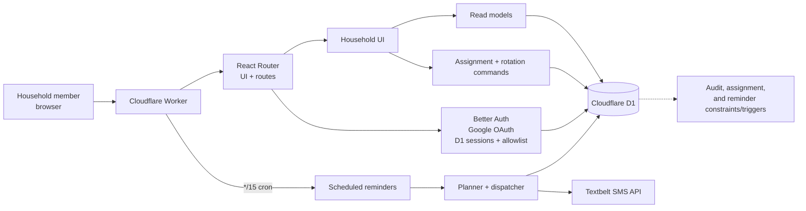

# ChoRotate

<p align="center">
  <a href="https://github.com/shanebishop1/chorotate/actions/workflows/ci.yml"></a>
  <a href="https://nodejs.org/en/download"></a>
  <a href="https://www.typescriptlang.org/"></a>
</p>

ChoRotate is a private, mobile-first household chore schedule. It answers who owns a chore now and next, lets household members adjust turns, and preserves an auditable record of every change.

## Features

- **Now** shows the current and next owner; **Mine** shows the signed-in member's upcoming turns.
- **Household** provides a calendar, totals, filters, and turn changes; **History** groups before/after state.
- Deterministic rotation with an independent boundary; authenticated one-turn reassignment or atomic swaps; consent-aware SMS reminders.

## Product behavior and limits

Each chore owns a seven-day period. Trash can run Friday–Thursday while Dishwasher runs Monday–Sunday. The household time zone, rather than the server time zone, controls boundaries and display dates.

The rotation engine materializes the current period plus 52 following periods (53 periods per active chore). Materialization is idempotent and does not overwrite manual changes. Current and future periods can be changed while open; ended periods cannot. Stale versions return a conflict rather than overwriting newer work. A swap changes both assignments in one database mutation.

| Area                       | Limit or default                                  |
| -------------------------- | ------------------------------------------------- |
| Operator household roster  | 1–50 members                                      |
| Default schedule window    | Six days back plus 12 weeks forward               |
| Household calendar request | 84 days maximum                                   |
| Calendar assignment result | 1,200 assignments maximum                         |
| Read page                  | 25 by default, 100 maximum; offset 10,000 maximum |
| Reminder planning horizon  | 14 household-local days                           |

## SMS delivery semantics

The scheduled Worker runs every 15 minutes: it dispatches due outbox items, plans new occurrences, then dispatches the newly planned items. Only the current **morning** occurrence is sendable; the schema retains an evening clock, but the planner currently disables evening occurrences.

For each chore period, at most one logical morning occurrence is created for the assigned member. It is eligible only for an active member with a valid E.164 number, `consented` status, and `not_suppressed` status. The send time is the household-local morning time.

The outbox leases bounded batches, records attempts, retries within its limit, and stores provider IDs plus sanitized outcomes. A changed assignment can mark an earlier accepted or delivery-unknown occurrence for correction, but no automatic correction SMS is promised.

Textbelt is the provider. Messages must fit one GSM-7 segment (160 septets). Provider acceptance means Textbelt accepted the request, not handset delivery. Timeouts and other ambiguous transport results become `delivery_unknown`. Occurrences are logically deduplicated, but Textbelt has no idempotency key, so exactly-once delivery, catch-up messages, and automatic correction SMS are not promised.

## Architecture



D1 is authoritative for household configuration, members, allowlisted identities, assignments, sessions, audit history, and the SMS outbox. Assignments are materialized records. Database constraints and triggers protect assignment integrity, audit immutability, and reminder uniqueness.

## Technology

- React `19.2.8` with React Router Framework Mode `8.3.1`; TypeScript `5.9.3`, Vite `8.2.2`, and Tailwind CSS `4.3.3`
- Cloudflare Workers, Wrangler `4.127.1`, D1 (SQLite), Better Auth `1.7.2`, and Google OAuth
- Textbelt, Vitest `4.1.11`, Playwright `1.62.1`, axe-core, Oxlint, and Oxfmt
- Node `24.20.0` with npm `11.19.0`

## Local development

### Fresh clone

Prerequisites are Git, [Mise](https://mise.jdx.dev/), and a supported shell. Mise installs the pinned Node runtime; Chromium is needed for browser tests.

```sh
git clone https://github.com/shanebishop1/chorotate.git
cd chorotate
mise install
node --version
npm --version
npm ci
cp .dev.vars.example .dev.vars
```

Node must report `v24.20.0` and npm must report `11.19.0`. `npm ci` runs the postinstall binding generation. The copied `.dev.vars` has deliberately unusable local placeholders.

Apply local D1 migrations, load the neutral seed, and start the Worker:

```sh
npx wrangler d1 migrations apply chorotate-local --local
npm run seed:local
npm run dev
```

Open <http://localhost:5173>. The seed creates the `chorotate` household, four placeholder members, two chores, rotations, and sample assignments. Its identities cannot authorize a real account, contacts are not sendable, and no production resource or SMS request is created.

### Google OAuth caveat

The checked-in local values use `example.invalid`, so a fresh clone cannot authorize a real Google account. For local sign-in, use a separate Google OAuth web client, put real test credentials in `.dev.vars`, and configure the local allowlist with the exact normalized test email.

```text
http://localhost:5173/api/auth/callback/google
```

Production uses the same path appended to the exact HTTPS canonical origin. OAuth does not bypass the D1 allowlist; the email must match an active identity, and the owner email must be in the allowed email set.

## Development and validation commands

```sh
npm run dev
npm run build
npm run preview
npm run format
npm run cf-typegen
npm run auth:schema:generate
```

```sh
npm run doctor
npm run format:check
npm run lint
npm run auth:schema:check
npm run cf-typegen:check
npm run typecheck
npm test
npm run test:workerd
```

Install Chromium once, then run the phone/desktop and light/dark browser matrix:

```sh
npm run test:browser:install
npm run test:browser
```

`npm run check` is the aggregate project check. `npm run check:release` expects a clean working tree and installed Chromium, then adds operator/deployment contract tests, build, browser tests, audit, secret scan, and drift checks.

```sh
npm run check
npm run check:release
npm run quality:contracts
npm run audit
npm run scan:secrets
npm run operator:contacts:test
npm run operator:d1:test
npm run deploy:production:test
```

## Private household and contact input

Production setup is operator-supplied and separate from Worker environment variables. The private JSON shape is:

```text
{
  "householdId": "chorotate", "householdName": "Household name",
  "recordedAt": "2026-09-06T12:00:00.000Z", "members": [{
    "id": "member-id", "displayName": "Display name", "email": "person@example.com",
    "phoneE164": null, "consent": "not_recorded", "suppression": "not_suppressed"
  }]
}
```

There must be 1–50 members. IDs are lowercase safe identifiers; display names and normalized lowercase emails are unique. `phoneE164` is `null` or a valid `+`-prefixed E.164 value. Consent is `not_recorded`, `consented`, or `revoked`; suppression is `not_suppressed` or `suppressed`.

Keep input and generated SQL outside the repository or under private `.chorotate`, with mode `0600`. Never commit, print, or log them. Preparation prints counts only, never email addresses or phone numbers.

```sh
npm run operator:bootstrap:prepare -- \
  --input <private-json> --output <private-bootstrap-sql> \
  --time-zone <iana-time-zone> --week-start <weekday> \
  --evening-time <HH:mm> --morning-time <HH:mm>

npm run operator:contacts:prepare -- \
  --input <private-json> --output <private-contact-sql>
```

## Production configuration and deployment

Production is Worker `chorotate-production` with D1 `chorotate-production`. The deploy wrapper builds with a temporary Wrangler configuration, deploys, and cleans it up. Child build/provider output is withheld.

Set these operator inputs without putting values in tracked configuration:

| Input                             | Meaning                                                                                                                                                                                                       |
| --------------------------------- | ------------------------------------------------------------------------------------------------------------------------------------------------------------------------------------------------------------- |
| `PRODUCTION_D1_DATABASE_ID`       | Existing D1 resource ID                                                                                                                                                                                       |
| `PRODUCTION_CANONICAL_ORIGIN`     | Exact HTTPS public origin                                                                                                                                                                                     |
| `PRODUCTION_HOUSEHOLD_TIME_ZONE`  | Valid IANA time zone                                                                                                                                                                                          |
| `PRODUCTION_HOUSEHOLD_WEEK_START` | `sunday` through `saturday`                                                                                                                                                                                   |
| `PRODUCTION_OWNER_EMAIL`          | Lowercase owner email                                                                                                                                                                                         |
| `PRODUCTION_ALLOWED_EMAILS`       | Comma-separated exact emails, including owner                                                                                                                                                                 |
| `PRODUCTION_REMINDER_SMS_ENABLED` | `true` or `false`; keep false until ready                                                                                                                                                                     |
| Reminder tuning                   | `PRODUCTION_REMINDER_BATCH_SIZE` (1–100); `PRODUCTION_REMINDER_LEASE_MILLISECONDS` (6,000–3,600,000 ms); `PRODUCTION_REMINDER_MAX_ATTEMPTS` (1–20)                                                            |
| Provider/retry tuning             | `PRODUCTION_REMINDER_PROVIDER_TIMEOUT_MILLISECONDS` (1,000–30,000 ms); `PRODUCTION_REMINDER_RETRY_BASE_MILLISECONDS` (1,000–3,600,000 ms); `PRODUCTION_REMINDER_RETRY_MAX_MILLISECONDS` (1,000–86,400,000 ms) |

Cloudflare secrets are `BETTER_AUTH_SECRET`, `GOOGLE_CLIENT_ID`, `GOOGLE_CLIENT_SECRET`, and `TEXTBELT_API_KEY`. Production rejects placeholders and keeps contacts out of the Worker environment contract.

Apply migrations before executing generated private SQL, then verify without sending SMS:

```sh
npm run operator:d1:migrations:list
npm run operator:d1:migrations:apply
npm run operator:d1:execute -- --file <private-sql>
npm run operator:d1:verify:dry-run
npm run operator:d1:verify
```

Remote verification additionally needs `PRODUCTION_HOUSEHOLD_MEMBER_COUNT`, `PRODUCTION_REMINDER_EVENING_LOCAL_TIME`, and `PRODUCTION_REMINDER_MORNING_LOCAL_TIME`. It checks migrations, exact household/member/identity/chore/rotation counts, contact readiness, and duplicate occurrences without printing values.

Run the dry run first. A real deployment requires explicit confirmation:

```sh
npm run deploy:production:dry-run
PRODUCTION_DEPLOY_CONFIRM=chorotate-production npm run deploy:production
```

The Worker cron is `*/15 * * * *`. Register the production canonical origin and Google callback before testing login.

## Security guarantees

- Google access requires an active exact normalized D1 allowlist identity; no wildcard or domain-wide access is accepted.
- Sessions are database-backed and rechecked on requests. Cookies are secure, HTTP-only, `SameSite=Lax`, and use a ChoRotate prefix.
- Authenticated mutations and sign-out require the exact canonical origin.
- Assignment commands validate household, active members, versions, boundaries, and operation identity server-side.
- Audit rows and SMS evidence are append-only; terminal SMS outcomes cannot be rewritten. D1 constraints and triggers enforce these invariants.
- Sensitive logging fields are redacted and production provider output is withheld by the operator/deployment wrappers.

## Operational caveats

- Local development uses local D1 and does not provision Cloudflare, configure a usable Google client, or send SMS.
- Bootstrap is first-run only; contact updates require an exact existing roster.
- SMS is disabled by default and fail-closed unless the runtime flag is valid.
- Cron timing, provider quotas, and ambiguous timeouts can delay or obscure SMS.
- A successful deploy does not prove OAuth, D1 bootstrap, consent, Textbelt quota, or handset delivery. Verify each separately.

## Repository structure

```text
app/
  auth/                  OAuth, allowlist, sessions, origin checks
  domain/
    commands/            assignment mutations and concurrency rules
    read-models/         bounded schedule, household, and history projections
    reminders/           SMS planning, outbox dispatch, Textbelt transport
    rotation/            chore periods, previews, and materialization
    storage/             D1 access boundaries and schema integration
  features/chore-relay/  responsive household UI and presentation
  routes/                home and authentication route modules
  runtime/               Worker context, config, and redaction
workers/                 fetch and scheduled Worker entry point
scripts/
  auth/                  auth schema validation and generation
  deployment/            production build, D1, and deploy wrappers
  operator/               private bootstrap, contacts, and D1 operations
  quality/                doctor, contracts, audits, and scans
migrations/              ordered D1 migrations
seed/                    neutral local-only structural seed
```
